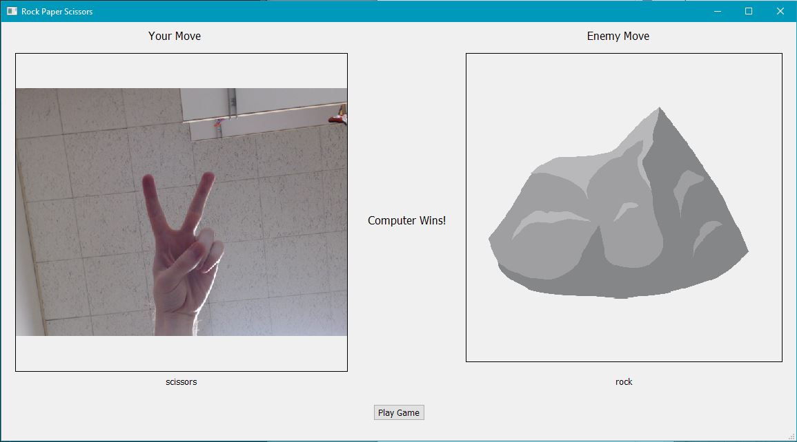

# RPSGame
Rock paper scissors game using a convolutional neural network for move recognition

See https://jjacobson.github.io/RPSGame/ For a detailed writeup on this project.

## Requirements
1. Tensorflow
2. PyQT
3. OpenCV-Python

## Example:

