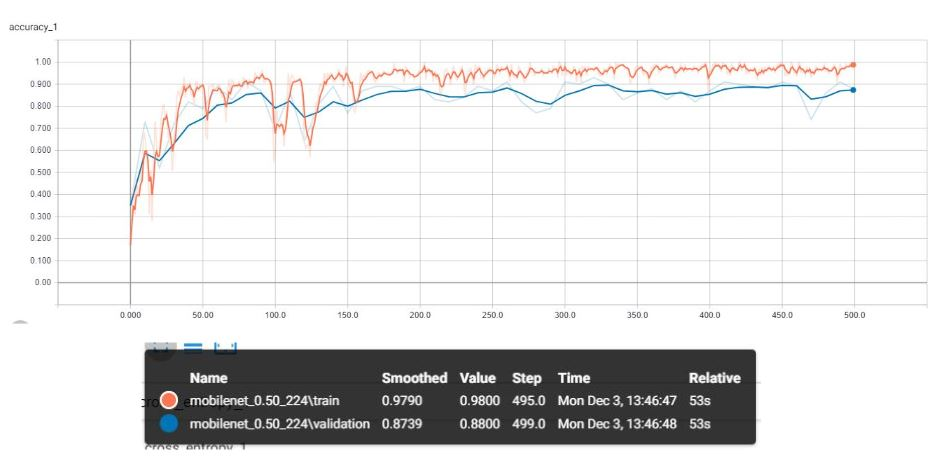

##### Technologies Used:
* [OpenCV-Python](https://pypi.org/project/opencv-python/)
* [Tensorflow](https://pypi.org/project/tensorflow/)
* [PyQT5](https://pypi.org/project/PyQt5/)

## The Problem

With the ever increasing use of robots in our society, the problem of recognizing specific objects becomes increasingly important. Robots need to be able to recognize objects that we see every day and react to them accordingly. We decided to use this problem as the basis for our project. Our primary goal was to find a way for a program to recognize and react to different hand gestures issued by a human. Using this idea, we chose to create an interactive Rock Paper Scissors game using image recognition for determining a player's move. We needed a way for the computer to recognize the three different hand gestures associated with the game in a reasonable amount of time.

## Previous Work

Before beginning the project, we reviewed the potential ways of achieving image recognition. The first method we looked at achieved finger recognition by computing the convex hull around a user's hand and using the convexity to determine the points where fingers are present. Using those points, the number of fingers in the image can be determined [[1]](https://medium.com/@muehler.v/simple-hand-gesture-recognition-using-opencv-and-javascript-eb3d6ced28a0). However, the drawback to this approach is that much of the recognition depends on the color of the players skin and must be pre-programmed with skin tone values before it will work. We decided that we wanted a way to recognize images without having to predetermine what the different gestures would look like for each individual user. Additionally, the Paper hand configuration could confuse the program as fingers were not always separated.

Eventually our research led us to the [Tensorflow project](https://www.tensorflow.org/tutorials/images/image_recognition), which is an open source library for high performance numerical computation that greatly simplifies the task of machine learning. Tensorflow can be combined with the [MobileNet](https://ai.googleblog.com/2017/06/mobilenets-open-source-models-for.html) computer vision models to allow for image recognition. MobileNets are small low latency models designed for applications with fewer resources available. We decided that using Tensorflow and the MobileNet model would give us the accuracy and speed of image recognition required for a Rock Paper Scissors game.

This image shows a comparison of the MobileNet model that we chose to use for this project versus some of the other models available. MobileNet provides very quick results at the cost of some accuracy [[2]](https://medium.com/@sumit.arora/training-a-neural-network-using-mobilenets-in-tensorflow-for-image-classification-on-android-14f2792f64c1).

## The Project

Modern image recognition models rely on millions of parameters and training them from scratch requires large amounts of time and computing power. Transfer learning allows us to shortcut this by taking an already trained model and reusing it in a new model [[3]](https://www.tensorflow.org/hub/tutorials/image_retraining).

We took advantage of this transfer training when creating our own model for recognizing the three different moves in the game. Using a simple python script, we scraped around 100 images for each category of move from Google image results. We then used these ~300 images to train the model to recognize the Rock Paper and Scissors hand configurations. Tensorboard provides accuracy data that can be viewed in the form of a graph during training. 10% of the training images are selected for the validation set and are used to ensure that the image recognition model is applicable to images other than the ones it was trained on. The accuracy graph created during training can be seen below.

The model seen in the graph was trained for 500 generations and took 53 seconds to complete. The validation data had a final accuracy of 88% compared to the training data's 98% accuracy.

We then applied the newly trained model to our application for the Rock Paper Scissors game. The model for our application can be seen below. Images are captured from the webcam using OpenCV and are interpreted by Tensorflow. The most likely result is compared to a random choice made by the computer, and the resulting winner is displayed through a PyQT UI. Displaying the webcam images on the PyQT UI is achieved through the use of a PyQT label and pixmap. 

## The Result

The resulting program was able to successfully recognize all three moves when analyzing images with little background noise. Our application was able to analyze the webcam images with a delay of around 0.2 seconds when running on a desktop and a delay of 0.7 seconds when running on a laptop. Tensorflow offers the ability to run with AVX enabled or on a GPU which could further improve these recognition speeds if required. However, the slight delay was acceptable for this application.

We found that the accuracy of the recognition greatly depended on the amount of background noise in the image. We analyzed the accuracy of the recognition in various scenarios resulting in the following accuracy data:

Hand over white background: 95% 
Hand over white background with upper body included: 90% 
Hand over average room background: 80% 
Hand over average room with upper body included: 75%

Overall, the recognition was much more successful than we had originally expected considering the small number of images that it was trained on.

## Next Time

Although the project was an overall success, there are a few small changes that could be made to further improve this project. The largest of which is a more efficient way of converting the webcam images captured with OpenCV into the image that is analyzed by Tensorflow. Currently images are written to the disk, which leads to some unnecessary lag time between capturing the image and recognizing the move made. Finding a better way of sending data between OpenCV and Tensorflow would alleviate this delay. 

Additionally, the image classification is much less accurate when trying to recognize images that have significant amounts of background noise. This is largely because most of the images we trained on were simple images of hands with white backgrounds scraped from the Google image results. Increasing the training data to include images with more objects in the background could help solve this accuracy issue. Additionally, our training set was relatively small so increasing the total number of images in each category could also help improve the accuracy of recognition. 